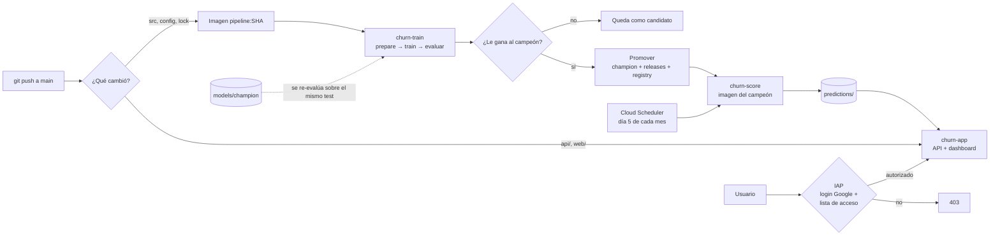

# Despliegue en GCP

Todo el sistema vive en GCP y se despliega solo desde GitHub Actions. Cada `git push` a
`main` despliega únicamente la pieza que cambió, y si lo que cambió es el modelo, lo
reentrena y lo pasa a producción **solo si le gana al que ya está**.

La app **no es pública**: para ver el dashboard o consultar la API hay que iniciar sesión
con una cuenta de Google que esté en la lista de acceso. Ver [Autenticación](#autenticación).

## Arquitectura

| Pieza | Servicio | Por qué |
|---|---|---|
| Datos, modelos y predicciones | **Cloud Storage** (`gs://PROYECTO-churn-fudo`) | Un bucket. Los contenedores lo montan como un disco con Cloud Storage FUSE, así que el código no sabe que está en la nube. |
| Entrenamiento y champion / challenger | **Cloud Run Job** `churn-train` | Corre unos minutos y se apaga. Es la misma imagen que `make docker-train`. |
| Scoring mensual | **Cloud Run Job** `churn-score` + **Cloud Scheduler** | Fijado a la imagen del modelo campeón. |
| Registro de modelos | `models/` en el bucket, y opcionalmente **Vertex AI Model Registry** | Historial de versiones con sus métricas y rollback. |
| Imágenes | **Artifact Registry** `churn` | Con política de limpieza para no pagar por imágenes viejas. |
| API + dashboard | **Cloud Run Service** `churn-app` + **Identity-Aware Proxy** | Un solo servicio, solo para usuarios autorizados. Escala a cero. |
| CI/CD | **GitHub Actions** + Workload Identity Federation | Sin claves JSON de cuentas de servicio. |



## Autenticación

La app corre detrás de **Identity-Aware Proxy (IAP)**, activado directamente sobre el
servicio de Cloud Run. Antes de que un request llegue al contenedor, IAP:

1. exige iniciar sesión con una cuenta de Google, y
2. verifica que esa cuenta tenga el rol *IAP-secured Web App User* sobre el servicio.

Si no cumple, responde 403 y la app nunca se ejecuta. Aplica a todo por igual: el
dashboard, `/api/v1/*` y `/docs`. No hay URL que saltee el login: el servicio además se
despliega sin acceso público (`--no-allow-unauthenticated`), así que la única identidad que
lo puede invocar es la propia de IAP.

- **Sin costo** y sin load balancer.
- **La app no maneja contraseñas ni tokens**: el login y la sesión son de Google.
- **El acceso se administra con IAM**: personas, grupos o un dominio de Google Workspace
  entero (por ejemplo, todos los `@fu.do`).

### Por qué API y dashboard son un solo servicio

IAP guarda la sesión en una cookie del dominio del servicio. Con el dashboard en
`churn-web-….run.app` y la API en `churn-api-….run.app`, el navegador los trata como sitios
distintos y no manda esa cookie en los `fetch` del dashboard a la API. Por eso la API
sirve también el dashboard: mismo origen, sin CORS y un servicio menos que desplegar. En
local sigue funcionando como antes (`make up`), sin autenticación.

### Configuración

**1. Cliente OAuth propio** — necesario si el proyecto **no pertenece a una organización**
de Google Cloud (el caso de una cuenta personal con el free trial) o si tienen que entrar
cuentas de fuera de la organización, como un `@gmail.com` o las de otra empresa. El
cliente que IAP trae por defecto solo deja entrar a usuarios de la organización del
proyecto. `bootstrap.sh` indica en cuál de los dos casos está el proyecto.

En la consola, **Google Auth Platform** (APIs y servicios → Pantalla de consentimiento):

1. **Branding**: nombre de la app (p. ej. "Fudo · Riesgo de Churn") y email de soporte.
2. **Audience**: tipo **External**. Mientras la app esté en modo *Testing*, Google solo deja
   iniciar sesión a los *test users* cargados ahí; publicarla (*Publish app*) evita mantener
   dos listas. Los datos que pide IAP (email y perfil) no requieren verificación de Google.
3. **Clients** → *Create client* → **Web application**. Guardar el *client ID* y el
   *client secret*.
4. En ese cliente, agregar la URI de redirección autorizada:
   `https://iap.googleapis.com/v1/oauth/clientIds/CLIENT_ID:handleRedirect`
   (reemplazando `CLIENT_ID`).
5. Aplicarlo, una vez que el servicio `churn-app` existe (después del primer despliegue):

   ```bash
   IAP_OAUTH_CLIENT_ID=... IAP_OAUTH_CLIENT_SECRET=... make gcp-iap-oauth GCP_PROJECT=mi-proyecto
   ```

   Se aplica **solo a `churn-app`**, no a todo el proyecto: si el proyecto tiene otros
   servicios de Cloud Run con IAP, siguen con su configuración. El secreto solo pasa por
   un archivo temporal: no queda en el repo ni en GitHub.

**2. Dar acceso.** Nadie entra hasta que se lo habilita explícitamente, y el servicio tiene
que existir (después del primer despliegue):

```bash
make gcp-grant  GCP_PROJECT=mi-proyecto MEMBER=user:ana@gmail.com
make gcp-grant  GCP_PROJECT=mi-proyecto MEMBER=group:cx@fu.do    # un grupo de Google
make gcp-grant  GCP_PROJECT=mi-proyecto MEMBER=domain:fu.do      # todo el Workspace
make gcp-access GCP_PROJECT=mi-proyecto                          # quién tiene acceso
make gcp-revoke GCP_PROJECT=mi-proyecto MEMBER=user:ana@gmail.com
```

`allUsers` y `allAuthenticatedUsers` se rechazan: abrirían los datos a cualquiera.
Administrar el acceso requiere ser dueño del proyecto (o tener `roles/iap.admin`); la
cuenta de servicio de GitHub Actions a propósito no puede.

### Uso

Al abrir la URL (`make gcp-url`) Google pide iniciar sesión. Una vez adentro, el dashboard
muestra con qué cuenta se entró y un botón **Salir**, que borra la sesión de IAP. Si la
sesión vence con el dashboard abierto, las consultas fallan con un aviso para recargar
la página, lo que vuelve a pedir el login.

`/docs` también pide login. Para consultar la API desde un script hay que presentar un
token OIDC de una cuenta con acceso, emitido para el *client ID* de IAP; el caso de uso
previsto es el navegador.

## Cómo decide si un modelo pasa a producción

El paso `churn retrain` entrena un **candidato** y lo enfrenta al **campeón** (el modelo que
genera las predicciones que ve CX). El candidato se promueve solo si cumple las tres
condiciones de `promotion` en [`config/model.yaml`](../config/model.yaml):

1. **Umbral de negocio**: PR-AUC de test ≥ `evaluation.min_pr_auc` (0.20).
2. **Mejora**: PR-AUC ≥ el del campeón + `min_improvement` (0.005). Un empate no alcanza:
   no se cambia el modelo en producción por ruido.
3. **Sin regresiones**: ROC-AUC no cae más de `max_regression.roc_auc` (0.01).

Lo importante es que **los dos modelos se evalúan sobre el mismo test**. Comparar el PR-AUC
guardado en cada artefacto no sirve: el campeón se evaluó cuando se entrenó, sobre otros
meses, y con un churn base que cambia de mes a mes la diferencia puede ser puro cambio de
muestra. Por eso el campeón se vuelve a scorear sobre el test del candidato. Si ya no se
puede (el feature engineering cambió y le faltan columnas), se usan sus métricas
guardadas y la decisión lo deja anotado.

La decisión queda en `models/candidates/<sha>/decision.json` (y en `decision.md`, legible)
y se muestra en el resumen de la corrida de GitHub Actions: la tabla de métricas de ambos
modelos y qué criterio pasó o falló.

### Por qué el scoring usa la imagen del campeón y no la del último commit

Un modelo solo sabe leer las features que armaba el código con el que se entrenó. Si un
commit cambia el feature engineering y su modelo **no** gana, el campeón sigue siendo el
anterior, y scorearlo con el código nuevo le pasaría columnas distintas. Por eso, al
promover, el job `churn-score` se fija a la imagen de esa versión (tag `champion` en
Artifact Registry): código y modelo viajan juntos.

## Qué dispara cada cosa

| Evento | Qué pasa |
|---|---|
| Push que toca `src/`, `config/model.yaml`, `pyproject.toml`, `poetry.lock` o el Dockerfile del pipeline | CI → imagen → reentrenamiento → champion/challenger → si gana, promoción y scoring |
| Push que toca `api/` o `web/` | CI → imagen → nueva revisión de `churn-app`, detrás de IAP |
| Día 5 de cada mes (Cloud Scheduler) | Scoring del último snapshot con el campeón |
| Día 6 de cada mes (GitHub Actions) | Reentrenamiento con los datos nuevos; si el modelo mejora, se promueve y se re-scorea |
| Actions → Deploy → Run workflow | A mano, con opciones para reentrenar, forzar la promoción o redesplegar la app |
| Pull request | Solo lint y tests |

## Layout del bucket

```
gs://PROYECTO-churn-fudo/
├── raw/                          snapshots mensuales (.csv.gz)
├── config/pricing.yaml           lista de precios (no está en git)
├── models/
│   ├── candidates/<sha>/         cada reentrenamiento, con decision.json y decision.md
│   ├── champion/                 el modelo en producción, con release.json
│   ├── releases/<sha>/           copia permanente de cada versión que fue campeona
│   ├── cloudshell/<fecha-hora>/  modelos entrenados a mano desde Cloud Shell
│   └── registry.json             historial de promociones
└── predictions/<periodo>/        lo que lee la API
```

Los candidatos se borran solos a los 180 días; las releases no vencen. El bucket no tiene
acceso público y solo la app (lectura) y los jobs (escritura) pueden leerlo.

## Puesta a punto (una vez)

**1. Proyecto con billing.** Con el free trial de USD 300 alcanza de sobra.

**2. `gcloud` actualizado.** IAP directo sobre Cloud Run necesita una versión reciente; los
scripts lo verifican y, si no, piden `gcloud components update`.

**3. Permisos de quien corre el bootstrap.** Owner del proyecto, o como mínimo:
`roles/run.admin`, `roles/storage.admin`, `roles/artifactregistry.admin`,
`roles/iam.serviceAccountAdmin`, `roles/iam.workloadIdentityPoolAdmin`,
`roles/resourcemanager.projectIamAdmin`, `roles/serviceusage.serviceUsageAdmin`,
`roles/cloudscheduler.admin`, `roles/iap.admin` y `roles/iap.settingsAdmin`. Para crear el
cliente OAuth en la consola, además `roles/oauthconfig.editor`.

**4. Crear la infraestructura.** Con `gcloud` autenticado (`gcloud auth login`) y el
snapshot en `data/`:

```bash
make gcp-bootstrap GCP_PROJECT=mi-proyecto

# Opcional: alerta por mail si el gasto pasa de USD 10
BILLING_ACCOUNT=XXXXXX-XXXXXX-XXXXXX make gcp-bootstrap GCP_PROJECT=mi-proyecto
```

[`bootstrap.sh`](bootstrap.sh) es idempotente y crea:

- el bucket, con el CSV subido comprimido y la lista de precios;
- el repositorio de Artifact Registry con su política de limpieza;
- una cuenta de servicio por pieza, cada una con el permiso mínimo (la app solo lee el
  bucket);
- la federación de identidad para que GitHub Actions, **solo desde `main` de este repo**,
  pueda desplegar sin guardar claves;
- la cuenta de servicio de IAP;
- el scheduler del scoring mensual.

**5. Cargar las variables en GitHub.** El script imprime al final los comandos exactos
(`GCP_PROJECT_ID`, `GCP_PROJECT_NUMBER`, `GCP_REGION`, `GCP_BUCKET`, `GCP_WIF_PROVIDER`,
`GCP_DEPLOYER_SA` y, opcional, `VERTEX_MODEL_REGISTRY=true`, que además requiere correr el
bootstrap con esa misma variable). Son variables, no secretos:
ninguna da acceso por sí sola.

**6. Primer despliegue.** Actions → Deploy → Run workflow, con *retrain* y *deploy_app*
tildados. Como todavía no hay campeón, el primer modelo se promueve si pasa el umbral de
negocio.

**7. Cliente OAuth y acceso.** Si tienen que entrar cuentas de fuera de la organización,
`make gcp-iap-oauth` (ver [Configuración](#configuración)). Después, `make gcp-grant` y
abrir `make gcp-url`.

**8. (Opcional) Aprobación humana antes de promover.** Settings → Environments →
`production` → *Required reviewers*. El workflow se frena antes del paso de promoción
hasta que alguien lo apruebe, y muestra la tabla de la decisión para decidir.

## Operación

**Llegó el snapshot de un mes nuevo.** Subirlo antes del día 5:

```bash
make gcp-upload-data FILE=data/account_stats_202609.csv
```

El día 5 se scorea con el campeón y el día 6 se reentrena con ese mes incluido.

**Reentrenar ya, sin esperar al día 6.** Actions → Deploy → Run workflow → *retrain*.

**Publicar un arreglo de scoring que no mueve las métricas.** Un cambio en
`src/churn/scoring/` reentrena, empata y no se promueve. Correr el workflow a mano con
*retrain* y *force_promote*: saltea la comparación contra el campeón, pero sigue exigiendo
el umbral de negocio.

**Rollback.** Volver a promover una versión anterior, que se busca en el historial:

```bash
make gcp-registry GCP_PROJECT=mi-proyecto
make gcp-release GCP_PROJECT=mi-proyecto TAG=<sha-anterior> FORCE=1
```

Restaura el modelo desde `models/releases/`, fija el scoring a la imagen de esa versión y
regenera las predicciones.

**Alguien dejó el equipo.** `make gcp-revoke MEMBER=user:...`. Si el acceso se da por grupo
o dominio de Workspace, alcanza con sacarlo del grupo o dar de baja la cuenta.

**Ver qué pasó en una corrida.**

```bash
gcloud run jobs executions list --job=churn-train --region=us-central1
gcloud storage cat gs://mi-proyecto-churn-fudo/models/candidates/<sha>/decision.md
```

Los logs de cada ejecución están en Cloud Run → Jobs → Executions.

## Entrenar desde Cloud Shell

El mismo camino que el lab de la clase 4: sin Cloud Run ni GitHub Actions. Se entrena a
mano en la VM de Cloud Shell y el modelo queda versionado en el bucket. No necesita el
bootstrap: Cloud Shell ya está autenticado y el script crea el bucket si falta.

En la **terminal** de Cloud Shell, con el repo clonado:

```bash
gcloud config set project mi-proyecto
make gcp-cloudshell-setup                                  # Poetry, dependencias y bucket
make gcp-cloudshell-upload FILE=~/account_stats_since_2024.csv   # ruta real al CSV
make gcp-cloudshell-train                                  # ~minutos
make gcp-cloudshell-models                                 # modelos entrenados
```

El CSV no está en git (tiene datos de cuentas reales). Se sube a Cloud Shell con *Más →
Subir* y queda en el home, o se sube al bucket desde la computadora local con
`make gcp-upload-data GCP_PROJECT=mi-proyecto FILE=data/...` (después del setup, que crea
el bucket).

Cada corrida deja `churn_model.joblib` y `metadata.json` en
`gs://PROYECTO-churn-fudo/models/cloudshell/<fecha-hora>/`, o en otra carpeta con
`RUN_ID=nombre`. Para usar ese modelo en cualquier lado alcanza con apuntarle el
`--model-dir` al bucket, que el código lee directo:

```bash
poetry run churn info  --model-dir gs://mi-proyecto-churn-fudo/models/cloudshell/20260913-180000
poetry run churn score --model-dir gs://mi-proyecto-churn-fudo/models/cloudshell/20260913-180000
```

Los mismos `make gcp-cloudshell-*` funcionan también desde una computadora local (Linux o
macOS). Fuera de Cloud Shell, antes hay que correr `gcloud auth application-default login`:
`gcloud auth login` no alcanza, porque el código escribe el bucket con las librerías de
Python y no con `gcloud`. El script lo verifica antes de entrenar.

### Dashboard y API desde Cloud Shell

Como en la clase 5: la API y el dashboard corren en Cloud Shell y se abren con **Vista
previa en la Web**. Es un solo proceso: la API sirve el dashboard en `/` y los datos en
`/api/v1`, desde el mismo origen.

```bash
make gcp-cloudshell-score      # predicciones del último mes con el último modelo del bucket
make gcp-cloudshell-serve      # API + dashboard en el puerto 8080
```

Después, botón **Vista previa en la Web** (arriba a la derecha) → *Vista previa en el
puerto 8080*. La documentación interactiva de la API está en `/docs` de esa misma URL.

- `make gcp-cloudshell-score RUN_ID=20260913-192551` usa un modelo puntual en vez del
  último, y `make gcp-cloudshell-serve PORT=8081` cambia el puerto.
- **Precios.** Se usa `gs://PROYECTO-churn-fudo/config/pricing.yaml` si existe; si no, el
  `config/pricing.yaml` local, y si tampoco está, el de ejemplo (el revenue en riesgo queda
  ilustrativo). Para usar los reales en Cloud Shell:
  `gcloud storage cp config/pricing.yaml gs://PROYECTO-churn-fudo/config/pricing.yaml`.
- **Quién puede entrar.** La URL de la vista previa solo abre con la cuenta de Google dueña
  de la sesión de Cloud Shell: a cualquier otra persona le devuelve un error. Además deja
  de responder al cortar el proceso o cerrar la sesión. Para compartir un link, ver abajo.
- Fuera de Cloud Shell el mismo comando levanta todo en `http://127.0.0.1:8080`.

### Compartir el dashboard con un link público

Como en la clase 6: la misma API + dashboard, publicada en Cloud Run con
`--allow-unauthenticated`.

> **El link no pide login.** Cualquiera que lo tenga ve los nombres de las cuentas, su
> riesgo y su facturación. El comando pide confirmación cada vez. Para que solo entren
> personas autorizadas está el despliegue detrás de IAP (`make gcp-deploy-app`, ver
> [Autenticación](#autenticación)).

Después de `make gcp-cloudshell-score`:

```bash
make gcp-cloudshell-publish     # ~3-4 min la primera vez; imprime la URL
make gcp-cloudshell-url         # volver a ver la URL
make gcp-cloudshell-unpublish   # darlo de baja
```

Qué hace:

1. Sube las predicciones y los metadatos del modelo a `gs://PROYECTO-churn-fudo/demo/`.
2. Construye la imagen de la API con Cloud Build. `.gcloudignore` deja afuera `data/` y
   `outputs/`, así que los datos crudos nunca salen del bucket.
3. Crea la cuenta de servicio `churn-demo`, con permiso solo de lectura sobre el bucket.
4. Despliega el servicio `churn-demo`, con el bucket montado de solo lectura. Es un
   servicio distinto de `churn-app`, que sigue siempre detrás de IAP.

Para actualizar los datos: `make gcp-cloudshell-score && make gcp-cloudshell-publish`.
Escala a cero, así que sin visitas no cuesta nada.

Si el deploy falla con un error de *organization policy* sobre `allUsers`, el proyecto
pertenece a una organización que prohíbe servicios públicos. En ese caso la única opción
es el despliegue con IAP.

**Memoria.** El feature engineering llega a ~4 GB. Si la VM de Cloud Shell tiene menos, el
script avisa antes de arrancar, y el proceso puede terminar en `Killed`. En ese caso hay
que entrenar en local con `make train` o con el job de Cloud Run.

Estos modelos no pasan por champion / challenger: son para experimentar. Lo que llega a
producción sigue siendo lo que promueve el workflow.

## Costos

Estimación mensual con un reentrenamiento por semana y uso normal del dashboard:

| Recurso | Uso | Costo |
|---|---|---|
| Cloud Run Jobs | ~5 ejecuciones × ~3 min × 2 vCPU / 8 GiB | dentro del free tier; sin él, ~USD 0.01 por corrida |
| Cloud Run Service | API + dashboard con `min-instances=0` | dentro del free tier |
| Identity-Aware Proxy | directo sobre Cloud Run | gratis |
| Cloud Storage | CSV comprimido + modelos + predicciones, < 1 GB | gratis: 5 GB en `us-central1` |
| Artifact Registry | 3 imágenes recientes por pieza + releases, ~2–3 GB | ~USD 0.20–0.30 (0.5 GB gratis) |
| Cloud Scheduler | 1 job | gratis (3 por cuenta) |
| Vertex AI Model Registry | solo catálogo, sin endpoint | gratis |
| GitHub Actions | ~15 min por push que reentrena | gratis hasta 2.000 min/mes (repo privado) |
| **Total** | | **menos de USD 1 por mes** |

Las decisiones que lo hacen barato:

- **Nada queda prendido.** Jobs que se apagan al terminar y un servicio que escala a cero.
- **IAP directo sobre Cloud Run**, sin el load balancer que antes hacía falta para
  autenticar (unos USD 18 por mes fijos).
- **`us-central1`** y no `southamerica-east1`: Cloud Run es tier 1 (más barato) y es una
  de las regiones con 5 GB gratis de Cloud Storage. Desde Buenos Aires suma ~150 ms de
  latencia, irrelevante para un dashboard mensual.
- **Las imágenes se construyen en GitHub Actions**, con cache de capas gratis. Cloud Build
  queda como alternativa manual (`make gcp-build`), sin la máquina `E2_HIGHCPU_8` que se
  pagaba desde el primer minuto.
- **Política de limpieza en Artifact Registry**: es donde se iría la plata sin darse
  cuenta, porque la imagen del pipeline es pesada y se construye una por commit.
- **El CSV se sube comprimido**: el loader lee `.csv.gz` directo.

### ¿Conviene entrenar o registrar fuera de GCP?

No para este proyecto. El entrenamiento tarda un minuto y en Cloud Run Jobs cuesta
centavos o nada; no hay dónde ahorrar. Las alternativas miradas:

- **Runner de GitHub Actions**: también gratis, pero el snapshot tiene datos de cuentas
  reales y habría que sacarlo de GCP en cada corrida, con credenciales de lectura del
  bucket en GitHub.
- **Vertex AI Custom Training / Pipelines**: el camino "oficial" de Vertex, pero cada
  corrida provisiona una VM y tarda minutos en arrancar, además del cargo por corrida de
  Pipelines. Tiene sentido con GPUs o entrenamientos largos, no con XGBoost sobre 700k
  filas.
- **MLflow en DagsHub, Weights & Biases**: registries con buena interfaz y free tier,
  pero suman un tercero con las métricas del negocio, y el registro en el bucket (más
  Vertex Model Registry para verlo en la consola) ya cubre versionado, historial y rollback.

## Seguridad

- **La app requiere login** con una cuenta de Google autorizada (IAP). Sin acceso público
  al servicio ni al bucket.
- **GitHub no guarda ninguna clave**: se autentica con Workload Identity Federation,
  limitada a la rama `main` de este repositorio, y no puede modificar quién accede a la app.
- **Cada pieza corre con su propia cuenta de servicio** y permisos mínimos.
- **Los datos de entrenamiento no salen de GCP**: el entrenamiento corre en Cloud Run.

## Límites conocidos

- **Cloud Run no tiene disco**: lo que el contenedor escribe fuera del bucket ocupa
  memoria. Por eso los jobs tienen 8 GiB aunque en local alcanza con 4.
- **GitHub desactiva los workflows programados** tras 60 días sin actividad en el repo. Si
  el proyecto queda quieto, el reentrenamiento del día 6 deja de correr (el scoring del
  día 5, que es de Cloud Scheduler, sigue).
- **Rollback de imágenes**: la política de limpieza conserva las imágenes que fueron
  campeonas (tag `release-*`), así que cualquier release se puede restaurar. Una versión
  que nunca se promovió se borra a los 7 días si no está entre las 3 últimas.
- **Solo cuentas de Google**: quien no tenga una puede crearla con su email actual.
